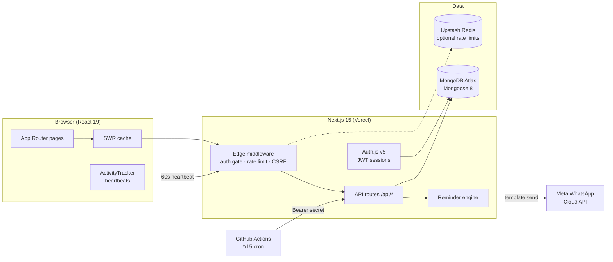

<p align="center">
  
</p>

<p align="center">
  <strong>A multi-user DSA practice platform: 15,000+ curated questions, progressive learning paths, per-user progress tracking, statistics, and WhatsApp study reminders.</strong>
</p>

<p align="center">
  <a href="https://github.com/ajaykumarsaini231/algo_trackr/actions/workflows/reminder.yml"></a>
  
  
  
  
</p>

---

> **Repository name note:** the repo is `algo_trackr`; the product brand is **DSAspire** (renamed during development).

## What is DSAspire?

DSAspire is a serious, information-dense workspace for mastering Data Structures & Algorithms. It ships with a seeded catalog of **15,267 problems** (LeetCode + Codeforces + Striver A2Z mappings), organizes them into **17 topics**, **163 algorithm patterns**, and **curated sheets** (Blind 75, DP/Graph/Tree sheets…), and tracks every user's progress in complete isolation. A progressive-unlock learning system stages questions from Foundation to Expert, and a WhatsApp reminder engine nudges you in the evening if you haven't hit your daily study goal — but **never while you're actively studying**.

## Features

- **Multi-user accounts** — Auth.js v5 (credentials), JWT sessions, roles (`user` / `admin` / `superadmin`), brute-force lockout, account moderation (block/suspend/soft-delete), force logout.
- **Per-user progress** — solved status, favorites, notes, ratings, revision scheduling and attempt counts are private per account; the question catalog is shared.
- **Learning system** — Foundation → Intermediate → Advanced → Expert stages with unlock thresholds; per-topic progressive unlock in batches of 5 (80% to unlock the next stage); priority-scored "continue learning" queue.
- **Dashboards & statistics** — completion overview, difficulty donut, topic/pattern/company progress, GitHub-style activity heatmap with streaks, monthly trends.
- **Google interview prep** — priority-weighted readiness score, coverage targets per topic, difficulty tiers, weekly recommendations.
- **Sheets** — Blind 75 (curated, link-matched) + dynamic sheets (Striver A2Z, DP, Graph, Trees, Greedy, Binary Search, Sliding Window, Two Pointers).
- **Search & filtering** — full filter grid (topic/subtopic/pattern/platform/difficulty/company/status/favorites/revision/rating) with regex-escaped search across catalog fields *and your own notes*.
- **Admin console** — user directory (cursor-paginated), read-only **User Dashboard Viewer**, secure superadmin **impersonation**, bulk import/export, audit logs, reminder operations dashboard.
- **WhatsApp reminders** — Meta Cloud API template messages scheduled by GitHub Actions; timezone-aware windows, active-time tracking with anti-gaming caps, slot-based duplicate prevention.
- **Hardened by default** — middleware auth gate, rate limiting (Upstash or in-memory), request-size caps, cross-origin write rejection, security headers + CSP, zod validation on every write, 90-day audit trail.

## Screenshots

> _Placeholders — drop PNGs into `docs/screenshots/` and update the paths._

| Dashboard | Learn | Admin — User Viewer |
| --- | --- | --- |
|  |  |  |

## Demo

No public demo is hosted yet. Run it locally in ~2 minutes (below) or deploy to Vercel with the [deployment guide](docs/DEPLOYMENT.md).

## Architecture (high level)



Deep dives: [ARCHITECTURE.md](docs/ARCHITECTURE.md) · [WORKFLOW.md](docs/WORKFLOW.md) · [DATABASE.md](docs/DATABASE.md) · [API.md](docs/API.md)

## Folder structure

```
├── .github/workflows/reminder.yml   # WhatsApp reminder scheduler (only scheduler)
├── docs/                            # All project documentation
├── dsa-question-db/                 # Standalone dataset pipeline (fetch → normalize → import)
├── public/                          # Logo, favicon, static assets
├── roadmap-tools/                   # One-off maintenance scripts (classification, ranking, seeding)
├── scripts/                         # Dev helpers (in-memory MongoDB, legacy migration)
└── src/
    ├── app/                         # Next.js App Router: pages + /api routes
    ├── auth.ts / auth.config.ts     # Auth.js v5 (Node + edge-safe configs)
    ├── components/                  # UI (admin/, charts/, layout/, questions/, ui/ …)
    ├── data/                        # Generated catalogs (patterns, company map)
    ├── hooks/                       # SWR data hooks
    ├── lib/                         # Domain logic (progress, reminder-engine, whatsapp, security …)
    ├── middleware.ts                # Edge gate for every page + API
    ├── models/                      # Mongoose models (11 collections)
    └── types/                       # Shared TypeScript types
```

Responsibilities per folder: [docs/ARCHITECTURE.md → Folder responsibilities](docs/ARCHITECTURE.md#folder-responsibilities).

## Tech stack

| Concern | Choice |
| --- | --- |
| Framework | Next.js 15 (App Router, edge middleware) |
| Language | TypeScript (strict) |
| UI | React 19, Tailwind CSS 3, Radix UI primitives, lucide-react icons |
| Animations | framer-motion (respects reduced motion) |
| Charts | Recharts (lazy-loaded) + hand-rolled SVG/CSS (heatmap, bars) |
| Database | MongoDB Atlas via **Mongoose 8** (no Prisma — see note below) |
| Auth | Auth.js (NextAuth v5 beta), bcryptjs, JWT sessions |
| Validation | Zod on every write path |
| Data fetching | SWR with global config |
| Rate limiting | @upstash/ratelimit + @upstash/redis (in-memory fallback) |
| Messaging | Meta WhatsApp Cloud API (template messages) |
| Scheduler | GitHub Actions cron (`*/15`) — no external queues |
| Notifications UI | sonner toasts |
| Deployment | Vercel (recommended) |

> **Why not Prisma?** The data layer is Mongoose. Prisma's MongoDB connector doesn't support real migrations (`prisma migrate` is unavailable for MongoDB) and the app leans on Mongo aggregation pipelines (`$facet`, `$unwind`, pipeline updates) that are first-class in Mongoose. Schema + indexes live in [`src/models/`](src/models) and are synced by Mongoose at boot.

## Installation

```bash
git clone https://github.com/ajaykumarsaini231/algo_trackr.git
cd algo_trackr
npm install
cp .env.local.example .env.local   # then fill it in (next section)
```

**Requirements:** Node ≥ 18.18, npm, and a MongoDB (Atlas or local).

## Running locally

```bash
# Option A — zero-install database (in-memory, data resets on stop):
npm run db:mem        # terminal 1: starts MongoDB on 127.0.0.1:27017
npm run dev           # terminal 2

# Option B — MongoDB Atlas: set MONGODB_URI in .env.local, then
npm run dev
```

Open http://localhost:3000, **register an account** (an email listed in `SUPER_ADMIN_EMAILS` becomes superadmin automatically), then optionally seed sample data from the Admin Panel or import the full dataset (see [Database setup](#database-setup)).

Other scripts: `npm run build` (production build), `npm run start`, `npm run lint`, `npm run typecheck`.

## Environment variables

Copy [.env.local.example](.env.local.example) and fill it. Every variable is documented in [docs/ENVIRONMENT.md](docs/ENVIRONMENT.md). The short list:

| Variable | Required | Purpose |
| --- | --- | --- |
| `MONGODB_URI` | ✅ | MongoDB connection string |
| `AUTH_SECRET` | ✅ | Auth.js JWT signing secret (`openssl rand -hex 32`) |
| `ADMIN_EMAILS` / `SUPER_ADMIN_EMAILS` | recommended | Role allowlists (comma-separated) |
| `REMINDER_CRON_SECRET` | for reminders | Bearer token for the GitHub Actions scheduler |
| `WHATSAPP_TOKEN`, `WHATSAPP_PHONE_NUMBER_ID` | for reminders | Meta Cloud API credentials |
| `UPSTASH_REDIS_REST_URL/TOKEN` | production | Durable cross-instance rate limiting |

Secrets live only in `.env.local` / Vercel env — both are git-ignored and must never be committed.

## Database setup

1. **Atlas:** create a free cluster, a database user, and allow your IP (or `0.0.0.0/0` for Vercel). Put the `mongodb+srv://` URI in `MONGODB_URI`.
2. Collections and **indexes are created automatically** by Mongoose on first use — there is no migration step.
3. **Seed data** (optional):
   - Small sample: Admin Panel → *Load sample data* (idempotent).
   - Full 15k dataset: the [`dsa-question-db/`](dsa-question-db) pipeline fetches, normalizes and imports the catalog — see its README.
4. Local SRV/DNS issues (`querySrv ECONNREFUSED`) are handled automatically via a DNS-over-HTTPS fallback; `MONGODB_DNS=8.8.8.8,1.1.1.1` is a faster manual override.

## Authentication setup

1. Set `AUTH_SECRET` (`openssl rand -hex 32`).
2. Put your email in `SUPER_ADMIN_EMAILS`, then **register through the UI** — the role is applied at registration and re-checked at every login.
3. The legacy **Admin Panel PIN** (8-digit, set up in `/admin`) still gates catalog operations (import/export/seed/question editing) and works alongside role-based admin. User management and impersonation require a role-based admin account. Details: [docs/ADMIN.md](docs/ADMIN.md).

## Meta Cloud API setup (WhatsApp reminders)

1. Create a Meta app with WhatsApp, get a **permanent access token** and your **phone number ID**.
2. Create/approve the template **`task_due_reminder`** (English) with **5 positional body parameters** — the exact approved body is documented in [docs/GITHUB_ACTIONS.md](docs/GITHUB_ACTIONS.md#the-whatsapp-template).
3. Set `WHATSAPP_TOKEN`, `WHATSAPP_PHONE_NUMBER_ID`, optionally `WHATSAPP_GRAPH_VERSION` / `WHATSAPP_TEMPLATE_LANG`.
4. Recipients must be reachable per Meta's rules (in development mode, only numbers on the recipient allowlist receive messages).

## GitHub Actions setup

The **only scheduler** is [.github/workflows/reminder.yml](.github/workflows/reminder.yml) (runs `*/15 * * * *`). Add two repository secrets:

- `REMINDER_APP_URL` — your deployed base URL (no trailing slash)
- `REMINDER_CRON_SECRET` — same value as the server env var

Until these exist the workflow fails fast with a clear error. Manual/dry runs: *Actions → WhatsApp reminders → Run workflow*. Full details: [docs/GITHUB_ACTIONS.md](docs/GITHUB_ACTIONS.md).

## Deployment

Vercel is the tested target — import the repo, set the environment variables, deploy. The complete guide (Atlas networking, secrets, domains, monitoring, backup/rollback) is in **[docs/DEPLOYMENT.md](docs/DEPLOYMENT.md)**.

## Usage

1. Register → land on your dashboard.
2. **Learn** picks your next-best questions per stage; **Topics** gives the progressive-unlock path per topic.
3. Track a question from its detail page: status, rating, notes, revision date, favorite.
4. **Revision** and the dashboard surface what's due; **Statistics** shows the full picture.
5. Enable **WhatsApp reminders** in Settings (phone + timezone required).

## API documentation

All ~35 endpoints (method, auth, params, validation, rate limits, error shapes, cURL examples) are documented in **[docs/API.md](docs/API.md)**. Everything uses a consistent envelope:

```json
{ "success": true,  "data": {} }
```
```json
{ "success": false, "error": "message" }
```

## Admin features · User features · Security

- Admin: [docs/ADMIN.md](docs/ADMIN.md) — panel, user management, dashboard viewer, impersonation, imports, audit logs, reminder ops.
- Full feature matrix: [docs/FEATURES.md](docs/FEATURES.md).
- Security model (roles, sessions, CSRF/XSS/NoSQL-injection posture, headers, OWASP mapping): [SECURITY.md](SECURITY.md).

## Performance

Catalog facets + per-user overlays (no 15k-doc lookups), keyset/cursor pagination in admin surfaces, indexed user-scoped queries, lazy-loaded chart bundles, SWR dedupe, heartbeat batching (≤1 write/user/min), and denormalized counters where sorting demands it. Details: [docs/PERFORMANCE.md](docs/PERFORMANCE.md).

## Roadmap / future improvements

- Automated test suite (unit + API + E2E) — **currently no tests**, see [docs/TESTING.md](docs/TESTING.md)
- Company progress UI activation once `companies[]` is populated at scale (fill tooling exists in `roadmap-tools/`)
- WhatsApp delivery webhooks (delivery/read receipts; current status is "accepted by Meta")
- `$text`/Atlas Search for free-text search (text index exists; regex path in use)
- OAuth providers (Google/GitHub) alongside credentials
- CI pipeline (typecheck + build + tests on PR)

## Contributing

PRs welcome — read [CONTRIBUTING.md](CONTRIBUTING.md) and the [developer guide](docs/DEVELOPER.md). Use the issue templates for bugs/features.

## License

**No license file is currently present**, which legally means "all rights reserved" by the repository owner. If you intend this to be open source, add a `LICENSE` file (MIT is the conventional choice for projects like this) — see [docs/RELEASE.md](docs/RELEASE.md).

## Acknowledgements & credits

- Question metadata sourced from public LeetCode/Codeforces APIs and the public Striver A2Z sheet mapping (see `dsa-question-db/`).
- Blind 75 list by NeetCode (public list, matched by problem link).
- UI primitives adapted from Radix UI; icons by lucide.
- Built by [@ajaykumarsaini231](https://github.com/ajaykumarsaini231) with AI-assisted development (Claude).

## FAQ

**Q: Is this Prisma?** No — Mongoose 8. See the tech-stack note above.
**Q: Where do admin rights come from?** `ADMIN_EMAILS` / `SUPER_ADMIN_EMAILS` env allowlists, applied at register/login. The 8-digit PIN only unlocks catalog tooling.
**Q: Why didn't I get a WhatsApp reminder?** You were active in the last 2 minutes, your goal is complete, you're outside your window, the slot already fired, or credentials/secrets are missing. The admin **Reminders** page and `?dryRun=1` explain exactly which rule matched.
**Q: Can other users see my notes/progress?** No — every user-state query is scoped to the session user server-side; admins can inspect via the audited User Dashboard Viewer.

## Troubleshooting

| Symptom | Fix |
| --- | --- |
| `querySrv ECONNREFUSED` connecting to Atlas | Automatic DoH fallback should kick in; or set `MONGODB_DNS=8.8.8.8,1.1.1.1` |
| `Invalid environment configuration` on boot | A required env var is missing — the error lists exactly which |
| 401 on every API call while signed in | Account was blocked/deleted or sessions were force-revoked — sign in again |
| WhatsApp error `132000` | Template parameter mismatch — the approved template needs exactly 5 positional params |
| GitHub Action failing | Repo secrets `REMINDER_APP_URL` / `REMINDER_CRON_SECRET` not set |

More: [docs/DEPLOYMENT.md → Troubleshooting](docs/DEPLOYMENT.md#troubleshooting).

## Support

Open a [GitHub issue](https://github.com/ajaykumarsaini231/algo_trackr/issues) with the bug/feature template. Security reports: see [SECURITY.md](SECURITY.md#reporting-a-vulnerability) — please do **not** open public issues for vulnerabilities.
