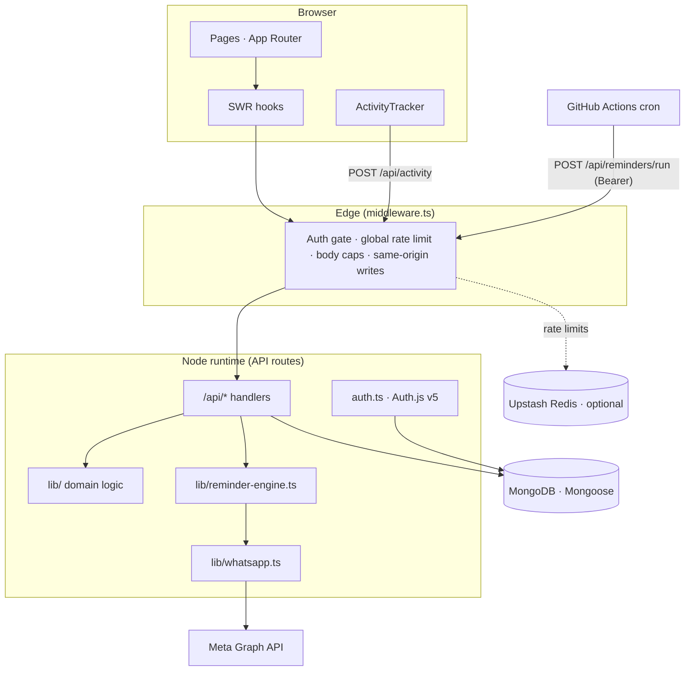
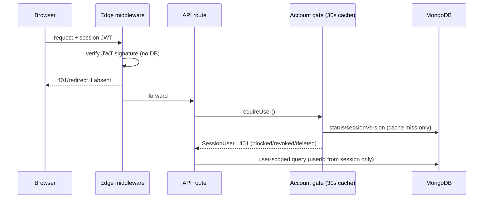
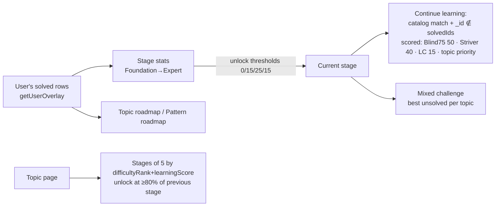
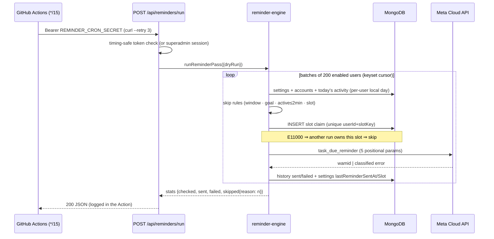

# Architecture

How DSAspire is put together, and why. Everything here describes the actual implementation — file paths are given so you can verify.

## Table of contents

1. [System overview](#system-overview)
2. [Frontend](#frontend)
3. [Backend / API design](#backend--api-design)
4. [Authentication](#authentication)
5. [Database](#database)
6. [Progress tracking (multi-user core)](#progress-tracking-multi-user-core)
7. [Learning flow](#learning-flow)
8. [Search flow](#search-flow)
9. [Scheduler + reminder engine + WhatsApp flow](#scheduler--reminder-engine--whatsapp-flow)
10. [Admin panel](#admin-panel)
11. [Analytics](#analytics)
12. [Caching](#caching)
13. [Scalability](#scalability)
14. [Folder responsibilities](#folder-responsibilities)
15. [Design patterns](#design-patterns)

---

## System overview



One Next.js app serves both the UI and the API. There is no separate backend service, no queue, no worker process — the only external actor is the GitHub Actions cron, which is just an authenticated HTTP client.

## Frontend

- **Next.js 15 App Router** under `src/app/`. Pages are client components (`"use client"`) that fetch through SWR hooks (`src/hooks/`) against `/api/*`; there is no server-component data fetching for user data (everything is session-scoped at the API layer).
- **Design system**: flat, dense, neutral surfaces with one teal accent; tokens are CSS variables in `src/app/globals.css`, consumed by Tailwind (`tailwind.config.ts`). Reusable primitives in `src/components/ui/` (Radix-based), domain components in `src/components/{admin,charts,dashboard,layout,questions,settings,shared,activity,brand}`.
- **App shell** (`src/components/layout/app-shell.tsx`): fixed sidebar + header, and mounts two invisible components — `ActivityTracker` (study-time heartbeats) and `ImpersonationBanner` (superadmin-only).
- **Charts**: Recharts is **lazy-loaded** via `next/dynamic` (donut on the dashboard, charts on statistics) so it never lands in the initial bundle; the heatmap and progress bars are plain CSS/SVG.

## Backend / API design

Every route in `src/app/api/**/route.ts` follows the same skeleton:

```ts
export async function GET(req: NextRequest) {
  return handle(async () => {                 // lib/api-response.ts — error envelope
    const user = await requireUser();         // lib/auth-helpers.ts — 401/403 guards
    const rl = await checkRateLimit("read", user.id);   // lib/rate-limit.ts
    if (!rl.ok) return tooManyRequests(rl.retryAfterSec);
    const parsed = parseOrError(schema, body); // zod on every write
    await connectDB();                         // lib/db.ts — cached connection
    // ... user-scoped queries only ...
    return ok(payload);                        // { success: true, data }
  });
}
```

- **Envelope**: `{ success, data | error }` everywhere; `handle()` converts thrown `HttpError`s to their status and hides internal errors in production.
- **Guards**: `requireUser` (session), `requireAdmin` (role admin/superadmin OR legacy PIN — catalog ops only), `requireRoleAdmin` (identified admin account — user management), `requireSuperAdmin` (impersonation/roles/deletes/resets).
- **Validation**: zod schemas in `lib/validations.ts` + per-route schemas; unknown keys are stripped, all inputs length-capped, sort fields whitelisted, regex input escaped.
- **Runtime**: all API routes are `nodejs` runtime + `force-dynamic`; the middleware is the only edge code and never touches Mongoose.

## Authentication

Split-config Auth.js v5 (see [SECURITY.md](../SECURITY.md) for the threat model):

- `src/auth.config.ts` — edge-safe: JWT strategy, 14-day sessions with 24h rolling refresh, cookie policy, no providers.
- `src/auth.ts` — Node: Credentials provider (bcrypt-12), per-email + per-IP lockout (DB-backed, 5 fails → 15 min), role re-derivation from env allowlists on every login, `sessionVersion` embedded in the JWT.
- `src/lib/auth-helpers.ts` — the **account gate**: every request re-validates the JWT's user against a 30s-TTL cached DB read (status, deletedAt, sessionVersion). Blocking, suspending, deleting or force-logging-out a user therefore kills live sessions within seconds despite stateless JWTs. Impersonation is resolved here too (superadmin + signed cookie → effective identity is the target with role forced down to `user`).



## Database

MongoDB via Mongoose 8 — 11 collections, all defined in `src/models/`. Full field/index reference: [DATABASE.md](DATABASE.md).

Core split:

| Collection | Role |
| --- | --- |
| `questions` | **Shared catalog** (15k docs) — titles, links, taxonomy, patterns, learning ranks. Read-mostly. |
| `user_progress` | **Per-user state** — status/favorite/notes/rating/revision/solvedAt keyed by unique `(userId, questionId)`. |
| `users` | Accounts, roles, moderation state, sessionVersion, denormalized `solvedCount`. |
| `user_activity` | Active study seconds per user per *local* day. |
| `reminder_settings` / `reminder_history` | WhatsApp preferences + slot-claimed send log. |
| `audit_logs` | 90-day TTL security trail. |
| `admin` / `failed_attempts` / `settings` / `taxonomy` | Legacy PIN admin, lockout state, app settings singleton, taxonomy cache. |

Connections are cached on the Node global (`lib/db.ts`) with `maxPoolSize: 10` for serverless safety, plus an automatic **DNS-over-HTTPS SRV fallback** for networks that block `mongodb+srv` lookups.

## Progress tracking (multi-user core)

The single most important design decision: the catalog stays shared; everything a user does lives in `user_progress`, and **every** read path merges the two through `src/lib/progress.ts`:

- `overlayQuestions(userId, docs)` — batch-fetch the caller's progress for a page of questions (one `$in` query — never N+1) and overlay it onto the legacy embedded shape, so client components didn't change at all during the multi-user refactor.
- `getUserOverlay(userId)` — ONE aggregation joining the user's own rows (small) with slim catalog fields; powers stats/learn/sheets computations in JS instead of 15k-doc `$lookup`s.
- `upsertProgress(userId, questionId, patch)` — a single atomic `findOneAndUpdate` with an aggregation-pipeline update: stamps `solvedAt` exactly once, syncs `revisionNeeded` with revision statuses, maintains `users.solvedCount`, and relies on the unique compound index to collapse concurrent upserts.
- `userStateFilterIds(userId, filters)` — resolves user-state list filters (status/favorite/revision/rating) into catalog `_id` constraints; "Not Started" is computed as *absence* of progress.

## Learning flow



Stage membership is defined once in `lib/learning.ts` as Mongo match fragments with a JS twin (`stageMatchesDoc`) so per-user bucketing happens in memory over the user's own rows. The per-topic progressive unlock (`/api/learn/topic/[slug]`) reveals batches of `STAGE_SIZE = 5`, unlocking the next batch at `UNLOCK_THRESHOLD = 80%`.

## Search flow

`GET /api/questions?search=` builds a **regex-escaped**, case-insensitive matcher over catalog fields (title/concept/tags/companies/topic/subtopic/pattern/platform) **plus** the caller's own notes (`noteSearchIds` resolves matching `user_progress` rows to `_id`s and ORs them in). Catalog filters go straight to indexed fields; user-state filters resolve to id sets first. A `title/concept/approach/notes/tags` text index exists on `questions` but the regex path is what's wired today (documented as a known optimization opportunity).

## Scheduler + reminder engine + WhatsApp flow



Key properties:

- **Never messages an active user**: "active" = heartbeat within 2 minutes, so crashed tabs expire naturally; the check is re-evaluated at send time each run.
- **Slot-claim uniqueness** makes overlapping runs and workflow retries harmless (at most one attempt per user per slot, ever).
- **Failure classes** (`auth`, `invalid_number`, `template`, `rate_limit`, `network`) from `lib/whatsapp.ts`; failures retry on the *next* slot; 3 consecutive auth failures halt the run (dead token fuse).
- Activity tracking feeding this is described in [WORKFLOW.md → Heartbeat](WORKFLOW.md#heartbeat--active-time-tracking).

## Admin panel

Two authorization planes (deliberate):

- **Catalog plane** (`requireAdmin`): question CRUD, import/export/seed, app settings — accepts role admins *or* the legacy hardened 8-digit PIN session.
- **People plane** (`requireRoleAdmin` / `requireSuperAdmin`): user directory, dashboard viewer, moderation, impersonation, audit logs, reminder ops — requires an *identified* admin account so every action is attributable in `audit_logs`.

The **User Dashboard Viewer** (`/admin/users/[id]`) reuses `computeUserStats()` — the exact function behind the user's own dashboard — so admin-seen numbers can never drift from user-seen numbers. **Impersonation** issues a 30-minute HMAC cookie; identity resolution can only *lower* privilege, and admin checks always evaluate the raw session.

## Analytics

All analytics are computed live from MongoDB (no separate warehouse): dashboard/statistics via `computeUserStats` (catalog `$facet` + user overlay), Google readiness via priority-weighted coverage/progress over `byTopic`, heatmap + streaks from `solvedAt` timestamps, monthly trends from calendar bucketing. "Recommendations" are rule-based (weekly Google recs, weak-topic detection, next-topic suggestions) — there is **no ML recommendation engine**.

## Caching

| Layer | What | TTL |
| --- | --- | --- |
| SWR (client) | every GET, dedupe 5s, keepPreviousData | session |
| Account gate | user status/role/sessionVersion | 30s |
| Activity prefs | timezone + goal for heartbeats | 60s |
| Rate limits | Upstash sliding windows (or per-instance Map) | per bucket |
| Mongoose connection | cached on global | process |

There is deliberately **no server-side response cache**: correctness of per-user data wins; the payloads are small aggregates.

## Scalability

- Reads scale by keeping per-user work proportional to the *user's own data* (overlay pattern), not catalog size.
- Admin lists use **keyset pagination** exclusively (no skip/offset), backed by dedicated indexes; sorting by solved count is served by the denormalized `users.solvedCount`.
- Heartbeats write ≤1 doc/user/minute; reminder runs stream users in batches of 200 with bounded send concurrency (8) and a per-run send cap (500).
- Known ceilings are documented honestly in [AUDIT.md](../AUDIT.md) (e.g. `$nin: solvedIds` in learn queries grows with a power user's solve count; regex search scans).

## Folder responsibilities

| Path | Responsibility |
| --- | --- |
| `src/app/**/page.tsx` | Screens; data via hooks; no direct DB access |
| `src/app/api/**/route.ts` | HTTP layer: guards, validation, rate limits, envelope |
| `src/lib/` | Domain logic — progress, user-stats, learning, sheets, patterns, google, reminder-engine, whatsapp, security, rate-limit, audit, impersonation, env |
| `src/models/` | Mongoose schemas + indexes (single source of DB truth) |
| `src/hooks/` | SWR wrappers per API surface |
| `src/components/ui/` | Presentation-only primitives |
| `src/middleware.ts` | Edge: auth gate, global rate limit, body caps, origin checks |
| `roadmap-tools/` | Operator scripts (dataset classification, ranking, company fill) — not part of the app runtime |
| `dsa-question-db/` | Independent dataset builder (fetch/normalize/import) |

## Design patterns

- **Guard-wrapper routes** (`handle` + `require*`) — auth can't be forgotten without the route failing closed.
- **Overlay pattern** — shared catalog + per-user delta, merged at read time; preserved legacy response shapes through a breaking refactor.
- **Claim-first idempotency** — unique-index claims before side effects (reminder slots, registration email races).
- **JS twins of Mongo predicates** — `stageMatchesDoc` / `sheetMatchesDoc` mirror query fragments for in-memory bucketing; each is documented to stay in sync with its Mongo counterpart.
- **Env-driven feature flags** — WhatsApp/Upstash features degrade cleanly to "configured: false" instead of crashing when unset.
- **Fail-fast env validation** — `lib/env.ts` zod-validates on first access with every problem listed.
