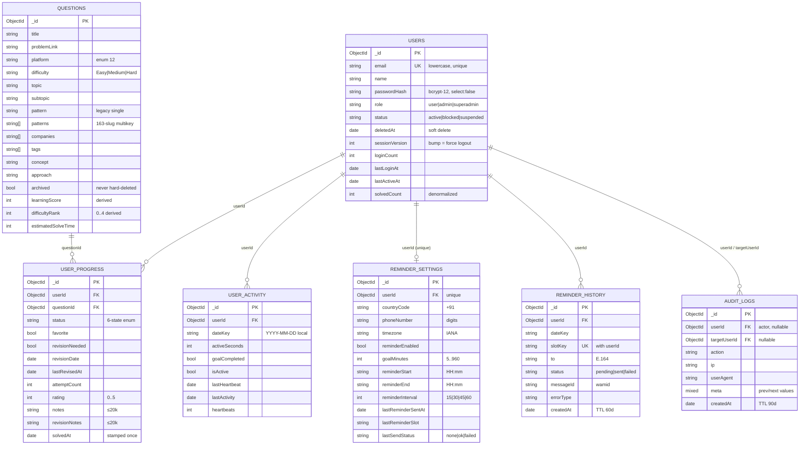

# Database

MongoDB via **Mongoose 8** (no Prisma). Schemas and indexes are defined in [`src/models/`](../src/models) and synced automatically by Mongoose — there is no migration step. All ObjectId references are plain fields (Mongo has no foreign keys); referential integrity is enforced in application code and by compound unique indexes.

## Collections at a glance

| Collection | Model file | Purpose | Growth |
| --- | --- | --- | --- |
| `users` | `User.ts` | Accounts, roles, moderation, counters | 1/user |
| `questions` | `Question.ts` | Shared problem catalog | ~15k, admin-curated |
| `user_progress` | `UserProgress.ts` | Per-user question state | ≤ users × touched questions |
| `user_activity` | `UserActivity.ts` | Active study time per local day | 1/user/day (active days only) |
| `reminder_settings` | `ReminderSettings.ts` | WhatsApp preferences + engine state | ≤1/user |
| `reminder_history` | `ReminderHistory.ts` | Send attempts (slot claims) | TTL 60 days |
| `audit_logs` | `AuditLog.ts` | Security/audit trail | TTL 90 days |
| `admin` | `Admin.ts` | Legacy PIN credential (singleton) | 1 |
| `failed_attempts` | `FailedAttempt.ts` | Brute-force lockout state per key | small |
| `settings` | `Settings.ts` | App settings singleton (`key: "app"`) | 1 |
| `taxonomy` | `Taxonomy.ts` | Cached topic taxonomy | small |

## ER diagram

## Indexes (complete list)

### `users`
| Index | Why |
| --- | --- |
| `{ email: 1 }` unique | login lookup, duplicate prevention |
| `{ createdAt: -1 }`, `{ lastLoginAt: -1 }`, `{ name: 1 }`, `{ loginCount: -1 }`* , `{ solvedCount: -1 }` | admin directory sorts (keyset pagination) |
| `{ status: 1 }`, `{ role: 1 }` | admin filters |

\* `loginCount` sorts use the field directly; small collections don't need it, added index set covers the offered sort keys.

### `questions`
| Index | Why |
| --- | --- |
| text index `title, concept, approach, notes, tags` | present for future `$text` search (regex path in use today) |
| `{ archived: 1, topic: 1, subtopic: 1 }` | list filters |
| `{ archived: 1, patterns: 1 }` (multikey) | pattern pages |
| `{ archived: 1, topic: 1, difficultyRank: 1, learningScore: -1 }` | progressive-unlock ordering |
| single-field: `difficulty`, `topic`, `pattern`, `companies`, `status`†, `favorite`†, `revisionNeeded`†, `archived`, `patterns`, `patternManual`, `learningScore`, `difficultyRank` | filter paths |

† Legacy single-user fields — frozen at defaults since the multi-user refactor; real state lives in `user_progress`.

### `user_progress`
| Index | Why |
| --- | --- |
| `{ userId: 1, questionId: 1 }` **unique** | one row per user per question; atomic upsert target |
| `{ userId: 1, status: 1 }`, `{ userId: 1, favorite: 1 }`, `{ userId: 1, revisionNeeded: 1 }` | user-state filters |
| `{ userId: 1, solvedAt: -1 }` | recent solves, heatmap source |
| `{ userId: 1, updatedAt: -1 }` | admin question-history cursor |

### `user_activity`
`{ userId: 1, dateKey: 1 }` unique · `{ dateKey: 1, lastHeartbeat: -1 }`

### `reminder_settings`
`{ userId: 1 }` unique · `{ reminderEnabled: 1, _id: 1 }` (engine cursor)

### `reminder_history`
`{ userId: 1, slotKey: 1 }` **unique** (duplicate prevention) · `{ createdAt: 1 }` TTL 60d · `{ status: 1, createdAt: -1 }` · `{ userId: 1, createdAt: -1 }`

### `audit_logs`
`{ createdAt: 1 }` TTL 90d · `{ userId: 1, createdAt: -1 }` · `{ targetUserId: 1, createdAt: -1 }` · `{ action: 1, createdAt: -1 }`

### `failed_attempts`
`{ key: 1 }` unique — keys are `admin`, `login:<email>`, `login-ip:<ip>`.

## Constraints & validation

- **Schema-level**: enums (status/role/platform/difficulty), min/max on numerics (rating 0–5, goal 5–960), maxlength on every string, `select: false` on `passwordHash`.
- **API-level**: zod validates every write before Mongoose sees it (`lib/validations.ts` + per-route schemas); unknown keys are stripped — user input can never smuggle query operators into documents.
- **Uniqueness as concurrency control**: `(userId, questionId)` collapses double-writes; `(userId, slotKey)` makes reminder sends idempotent; `email` catches registration races (E11000 handled explicitly).
- **Soft deletion only**: questions use `archived`; users use `deletedAt`. Nothing is hard-deleted by application flows (admin progress-reset is the one explicit, superadmin-gated, audited exception).

## Key aggregation pipelines

| Where | Pipeline | Purpose |
| --- | --- | --- |
| `lib/user-stats.ts` | single `$facet` over `questions` (counts, byDifficulty/Topic/Pattern/Platform/Company via `$unwind`, monthlyAdded) | catalog totals — identical for all users, one round trip |
| `lib/progress.ts → getUserOverlay` | `user_progress $match userId` → `$lookup questions` (slim projection) | the user's world in one query; feeds stats/learn/sheets |
| `lib/progress.ts → upsertProgress` | `findOneAndUpdate` with **aggregation-pipeline update** (`$ifNull` defaults, conditional `solvedAt: "$$NOW"`) | atomic read-modify-write without a transaction |
| `/api/learn` | catalog match + `SCORE_STAGE` (`$addFields` weighted score) + `_id ∉ solvedIds` | ranked unsolved queue |
| `/api/admin/users` | `$match userId ∈ page` → `$group` per-user counts | per-page enrichment without N+1 |
| `/api/admin/reminders` | 36h `$match` → `$group` sent/failed per user | ops dashboard |

## Transactions policy

Multi-document transactions are deliberately avoided: every hot path is designed around **single-document atomicity** (pipeline upserts) plus **unique-index claims**, which work on any topology including the dev in-memory server (standalone Mongo has no transactions). The one accepted approximation — `users.solvedCount` maintenance — is a read-then-`$inc` with a self-limiting race, recounted from source-of-truth on every admin progress reset.

## Dataset pipeline (`dsa-question-db/`)

A standalone Node pipeline (own `package.json`) that fetches LeetCode/Codeforces metadata, merges Striver A2Z mappings, normalizes to the `questions` schema and bulk-imports. Its large output files stay out of git (only `dsa-questions.sample.json` + `stats.json` are committed). Derived learning fields (`learningScore`, `difficultyRank`, `estimatedSolveTime`) are backfilled by `roadmap-tools/rank-learning.mjs`; pattern slugs by `roadmap-tools/classify-patterns.mjs`.
