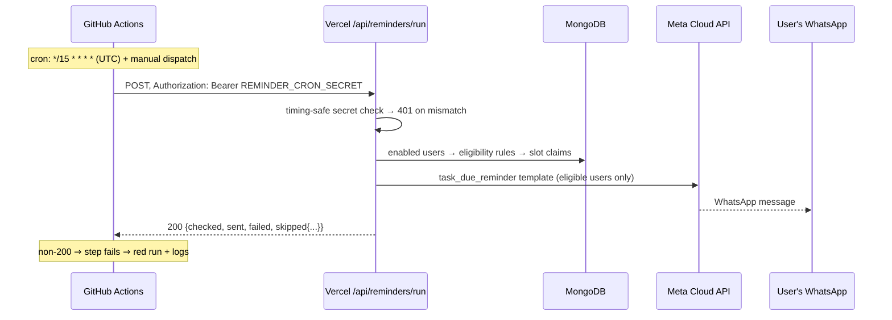

# GitHub Actions — Reminder Scheduler

GitHub Actions is the **only scheduler** in the system (no Cloud Run, Firebase, Lambda, Railway, queues, or Redis workers). One workflow triggers the reminder engine over HTTPS; all intelligence lives server-side.

Workflow file: [`.github/workflows/reminder.yml`](../.github/workflows/reminder.yml)

## What it does



## Schedule & cron semantics

- `cron: "*/15 * * * *"` — every 15 minutes, **24/7, in UTC**. Per-user evening windows (e.g. 20:00–23:45 *in the user's own timezone*) are evaluated server-side, so a single global schedule serves every timezone.
- GitHub cron is best-effort: runs can start a few minutes late under load. The engine's **slot arithmetic** (`slot = floor(local-minutes-of-day / interval)`) absorbs drift — a late run still lands in the correct slot, and a skipped GitHub run simply means that slot is attempted by no one (next slot fires normally).

## Secrets

Repository → *Settings → Secrets and variables → Actions*:

| Secret | Value |
| --- | --- |
| `REMINDER_APP_URL` | `https://your-app.vercel.app` (no trailing slash) |
| `REMINDER_CRON_SECRET` | exact same string as the server env var |

The workflow fails immediately with a clear `::error::` if either is missing. The secret travels only in the `Authorization` header over HTTPS and is compared server-side with `crypto.timingSafeEqual`.

## Retries & failure recovery

- `curl --retry 3 --retry-delay 5 --retry-all-errors --max-time 90` — transient network errors and 5xx are retried inside the step.
- **Retries can never double-send**: the engine claims `(userId, slotKey)` under a unique index *before* calling Meta, so a retried request finds the slot claimed and skips.
- `concurrency: group: whatsapp-reminders` prevents overlapping workflow instances (a slow run blocks the next rather than racing it) — and even a race would be harmless for the same reason.
- Send-level failures (invalid number, rate limit, network) are recorded in `reminder_history` and retried automatically **on the next slot**; a dead access token trips a fuse after 3 consecutive auth failures and halts the run early.

## Manual runs & dry runs

*Actions → WhatsApp reminders → Run workflow* — with the **dryRun** checkbox the endpoint is called with `?dryRun=1`: full eligibility evaluation, zero sends, zero slot claims, and the response lists per-user decisions. Superadmins can trigger the same dry run from **/admin/reminders** in the app (session-authenticated path).

## Logs & observability

- Each run's step prints the HTTP status and the full JSON stats: `{checked, sent, failed, wouldSend, skipped: {reason: count}, haltedEarly, durationMs, decisions[≤50]}`.
- Server-side, every run writes an `audit_logs` entry (`reminder.run` / `reminder.run_dry`) with the same stats, and every send attempt is a `reminder_history` document — the **/admin/reminders** dashboard shows 24h totals, per-user state and recent failures.

## How GitHub talks to Vercel

Plain HTTPS `POST` to a **public route** (`/api/reminders/run` is exempted from the session gate in `src/middleware.ts`) that authenticates itself via the Bearer secret — there is no GitHub↔Vercel integration, OIDC, or webhook involved. Anyone without the secret receives an indistinguishable `401`.

## How Meta is called

`src/lib/whatsapp.ts` → `POST https://graph.facebook.com/{version}/{phoneNumberId}/messages` with a 15s timeout. Errors are classified (`auth` / `invalid_number` / `template` / `rate_limit` / `network` / `unknown`) and stored (truncated, token-free) for the admin failure feed.

## The WhatsApp template

Approved template **`task_due_reminder`** (language `en`, **POSITIONAL** parameters — verified against the live template definition via the Graph API):

```
Hello {{1}},

Reminder: Your task is {{2}}.

Task: {{3}}
Due Date: {{4}}
Priority: {{5}}

Please complete it as soon as possible.
Reply "done" once completed.
```

Parameter mapping (built in `lib/reminder-engine.ts`):

| Slot | Content | Example |
| --- | --- | --- |
| `{{1}}` | user's name | `Ajay` |
| `{{2}}` | status phrase | `due today` |
| `{{3}}` | goal summary | `Daily study goal 60 min (35 min done)` |
| `{{4}}` | date in the user's timezone | `12 Jul 2026` |
| `{{5}}` | remaining time | `25 min remaining` |

Sending with a different parameter count fails with Meta error **132000** — if you edit the template, keep five positional body parameters or update `sendReminderTemplate` accordingly.
