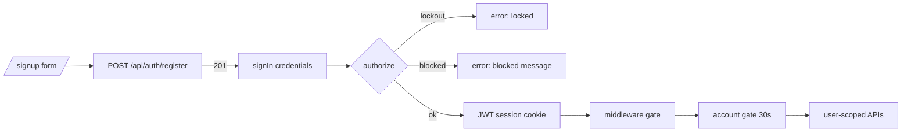
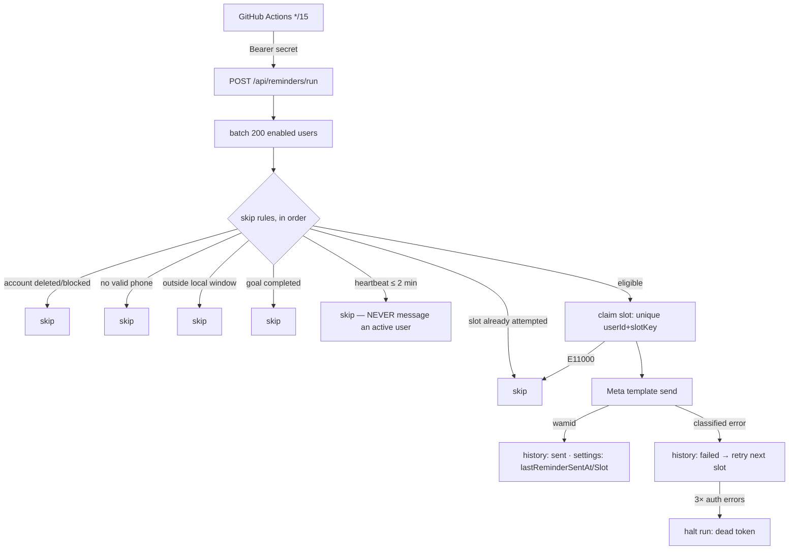
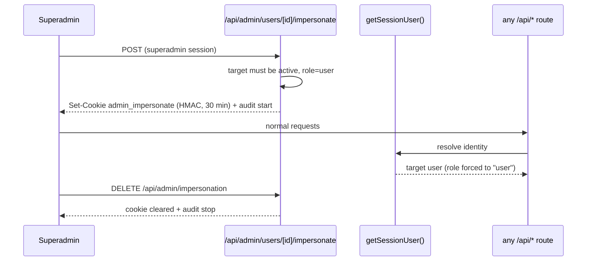

# Workflows

Step-by-step walkthroughs of every significant flow, exactly as implemented.

## Registration & login

1. `/signup` → `POST /api/auth/register` — zod validation, per-IP rate limit, bcrypt-12 hash, role derived from `SUPER_ADMIN_EMAILS`/`ADMIN_EMAILS`, duplicate-email race caught by the unique index, audit `auth.register`.
2. The client then signs in through Auth.js credentials (`csrfToken + email + password`).
3. `authorize()` checks per-email **and** per-IP lockouts, burns a constant-shape bcrypt compare, rejects blocked/suspended/deleted accounts with friendly codes, re-derives the role from env, increments `loginCount`, stamps `lastLoginAt`, and returns `{id, role, sessionVersion}` into the JWT.
4. Every subsequent request: middleware verifies the JWT at the edge; the **account gate** re-checks status/`sessionVersion` against the DB (30s cache) inside `requireUser()`.

## Question progress

- Any signed-in user PATCHes `/api/questions/[id]` with user-state keys → `upsertProgress()` writes their own `(userId, questionId)` row atomically: `solvedAt` stamped exactly once, revision statuses force `revisionNeeded`, `users.solvedCount` maintained.
- Reads (`GET /api/questions`, detail, stats, learn, sheets, patterns) merge catalog + the caller's rows via the overlay helpers — other users' state is unreachable by construction.
- "Not Started" filtering = questions with **no** progress row (or an explicit default row).

## Topic / pattern / company progress

- **Topic**: `stats.byTopic` = catalog totals (facet) + your solved counts (overlay); topic pages and the learn roadmap reuse the same numbers.
- **Pattern**: multikey `patterns[]` slugs → `/api/patterns` dashboard; solved counts from your overlay rows' pattern slugs.
- **Company**: `stats.byCompany` totals via `$unwind: companies` + your solved counts. UI shows companies only when the catalog field is populated (`roadmap-tools/fill-companies.mjs` exists for enrichment; sparse today — honest empty states instead of fabricated data).

## Statistics & recommendations

- `GET /api/stats` → `computeUserStats()`: one catalog `$facet` + one user overlay pass → totals, splits, monthly trend, 182-day heatmap, recent lists.
- Recommendations are **rule-based**: Google weekly list (top-25 unsolved by topic priority, Striver/LeetCode preference), weak topics (lowest completion among Critical/High priority), next-topic/next-sheet suggestions in topic learning. No ML.

## Revision

- Flagging: status `Need Revision`/`Revisit` or explicit `revisionNeeded`, plus optional `revisionDate` scheduling and `lastRevisedAt` stamps (`"now"` sentinel supported).
- Surfacing: dashboard "Revision due", `/revision` page (filter `revision=true`), per-user buckets (due today / missed / upcoming) in the admin viewer.

## Heartbeat / active-time tracking

1. `ActivityTracker` (mounted in the app shell, signed-in only) ticks every 5s; a tick counts only when the tab is **visible**, window **focused**, and there was input (mouse/key/scroll/touch) within 2 minutes.
2. Accumulated seconds flush as one `POST /api/activity` per 60s **only while there's something to report**; idle clients go silent. Tab close/hide sends a final `sendBeacon`.
3. Server credits `min(reported, real elapsed + 90s, 600)` into `user_activity` for the user's **local** day (timezone from reminder settings, else client), sets `isActive`/`lastHeartbeat`, and stamps `goalCompleted` once the goal is crossed.
4. Nobody sweeps stale flags: "active" is always *derived* as `lastHeartbeat ≤ 2 min ago`.

## Reminder engine (every 15 minutes)

Stops immediately (next run) when: the user becomes active, the goal completes, reminders are disabled, or the end time passes. Duplicates are impossible within a slot (unique claim), and `lastReminderSlot` short-circuits the common case.

## GitHub Actions & Meta API

See [GITHUB_ACTIONS.md](GITHUB_ACTIONS.md) for the workflow, retries, secrets, template mapping, and how retried runs stay idempotent.

## Search & filtering

1. Client debounces input → `GET /api/questions?search=...` (plus any filter params).
2. Server escapes regex metacharacters, caps length, builds an `$or` across catalog fields **and** your note-matching question ids; independent OR-groups (search, revision) are ANDed so filters always narrow.
3. Catalog filters hit indexed fields directly; user-state filters resolve through your progress rows first; page results get one batched progress overlay (no N+1).

## Admin operations

- **Import**: Admin Panel → paste/upload rows → `POST /api/import` (≤5000 rows, ≤8 MB): header normalization → per-row zod (invalid rows counted, not fatal) → `append` (insertMany) or `upsert` (by problemLink, else title+platform). Audited with counts.
- **Export**: `GET /api/export?format=json|csv[&all=true]` → file download. Audited.
- **Seed**: idempotent sample-set insert (skips existing titles).
- **User management**: directory → user page → moderation actions; every action audited with prev/next; block/suspend/delete kill live sessions via `sessionVersion`.
- **Impersonation**: superadmin → "Login as user" → 30-min signed cookie → the whole app serves the target's data with role forced to `user` → banner → "Return to admin" clears cookie + SWR cache. Start/stop audited.
- **Audit logs**: `/admin/audit` — filter by action class, follow actor/target links.

